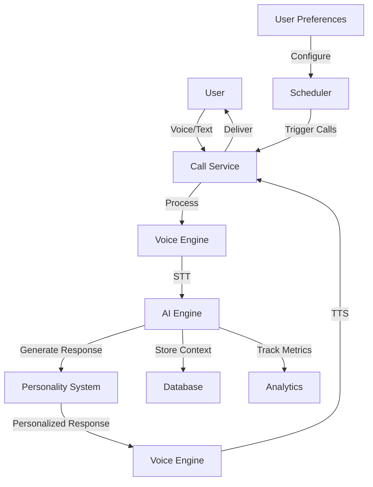

# 🏗️ DisciplineCall.ai Architecture

## 📋 **Overview**

DisciplineCall.ai is designed as a modular, scalable system that supports both cloud and local deployment modes. The architecture emphasizes voice-first interaction, AI personalization, and proactive user engagement.

## 🎯 **Core Principles**

- **Proactive Communication**: System initiates contact rather than waiting for user action
- **Voice-First Design**: Optimized for natural voice conversations
- **AI Personalization**: Adapts to individual user patterns and preferences
- **Multi-Platform Support**: Works across phone, Telegram, WhatsApp
- **Privacy Options**: Full local deployment available for sensitive users
- **Scalable Architecture**: From single users to enterprise deployments

## 🧱 **System Components**

### **🤖 AI Engine (`backend/core/ai_engine.py`)**
- **Purpose**: Core conversation and personality management
- **Cloud Mode**: OpenAI GPT-4o, Anthropic Claude
- **Local Mode**: Llama 2, Mistral, local fine-tuned models
- **Features**:
  - Multiple personality modes (Motivator, Drill Sergeant, Abuser, Friend, Mentor)
  - Context-aware conversations
  - Metrics analysis and insights
  - Personalization based on user patterns

### **🎙️ Voice Engine (`backend/core/voice_engine.py`)**
- **Purpose**: Text-to-speech and speech-to-text processing
- **TTS Providers**: ElevenLabs (cloud), Coqui TTS (local), OpenAI TTS
- **STT Providers**: OpenAI Whisper (cloud/local), Azure Speech
- **Features**:
  - High-quality voice synthesis
  - Personality-matched voice styles
  - Multi-language support (planned)
  - Real-time voice processing

### **📞 Call Service (`backend/services/call_service.py`)**
- **Purpose**: Multi-platform communication management
- **Providers**: Twilio (phone), Telegram Bot API, WhatsApp Business API
- **Features**:
  - Scheduled proactive calls
  - Interactive voice conversations
  - Call routing and fallbacks
  - Response handling and processing

### **🌐 API Layer (`backend/api/`)**
- **FastAPI**: Modern Python web framework
- **Endpoints**: Auth, Users, Calls, Metrics, Analytics
- **Features**:
  - RESTful API design
  - OpenAPI documentation
  - Authentication and authorization
  - Real-time WebSocket support (planned)

## 📊 **Data Flow**



## 🏗️ **Deployment Modes**

### **☁️ Cloud Deployment**
```yaml
Services:
  - FastAPI application (Vercel/Railway)
  - PostgreSQL (Supabase/Neon)
  - Redis (Upstash/ElastiCache)
  - Celery workers (background tasks)
  - External APIs (OpenAI, ElevenLabs, Twilio)

Advantages:
  - Zero setup for users
  - Best AI model quality
  - Automatic scaling
  - Global availability

Considerations:
  - Data leaves user environment
  - Subscription costs
  - Internet dependency
```

### **🏠 Local Deployment**
```yaml
Services:
  - Docker containers (all services)
  - Local PostgreSQL/SQLite
  - Local Redis
  - Local AI models (Ollama, Llama.cpp)
  - Local TTS/STT models

Advantages:
  - Complete privacy
  - No internet required
  - No ongoing costs
  - Full customization

Considerations:
  - Higher setup complexity
  - Lower AI quality (currently)
  - Hardware requirements
```

## 📱 **Platform Integration**

### **📞 Phone Calls (Twilio)**
```python
Flow:
1. Schedule call via Celery
2. Generate personalized message (AI)
3. Convert to audio (TTS)
4. Initiate Twilio call with TwiML
5. Process user speech response (STT)
6. Generate AI follow-up
7. Continue conversation or end call
```

### **💬 Telegram Bot**
```python
Flow:
1. Send voice message to user
2. User responds with voice message
3. Download and process audio (STT)
4. Generate AI response
5. Convert to voice (TTS)
6. Send voice response back
```

### **📱 WhatsApp Business**
```python
Flow:
1. Upload audio file to WhatsApp
2. Send voice message via Business API
3. Receive user voice response
4. Process and respond similarly to Telegram
```

## 🗄️ **Database Schema**

### **Core Tables**
```sql
users
├── id (uuid)
├── name
├── phone/telegram_id/whatsapp_id
├── preferences (json)
├── personality_mode
├── timezone
└── created_at

calls
├── id (uuid)
├── user_id (fk)
├── call_type (morning/midday/evening)
├── status (scheduled/completed/missed)
├── platform (phone/telegram/whatsapp)
├── scheduled_at
└── completed_at

conversations
├── id (uuid)
├── call_id (fk)
├── message_type (user/ai)
├── content (text)
├── audio_url
└── timestamp

metrics
├── id (uuid)
├── user_id (fk)
├── date
├── metric_type
├── value
└── source (call/manual)
```

## ⚙️ **Configuration Management**

### **Environment-Based Settings**
```python
# Cloud configuration
DEPLOYMENT_MODE=cloud
OPENAI_API_KEY=sk-...
ELEVENLABS_API_KEY=...
TWILIO_ACCOUNT_SID=...

# Local configuration
DEPLOYMENT_MODE=local
LOCAL_LLM_MODEL=llama2
LOCAL_TTS_MODEL=coqui
LOCAL_DATA_PATH=./user_data
```

### **Feature Flags**
```python
PENALTY_SYSTEM_ENABLED=true
MULTI_LANGUAGE_ENABLED=false
ANALYTICS_ENABLED=true
LOCAL_ONLY=false
```

## 🔒 **Security & Privacy**

### **Data Protection**
- **Encryption**: All sensitive data encrypted at rest and in transit
- **Access Control**: Role-based permissions for API access
- **Audit Logging**: Complete audit trail of all data access
- **Data Retention**: Configurable retention policies

### **Privacy Modes**
- **Cloud Mode**: Standard privacy with cloud providers
- **Local Mode**: Complete data isolation on user hardware
- **Hybrid Mode**: Local AI with cloud communication services

## 📈 **Scalability Considerations**

### **Horizontal Scaling**
- **API**: Multiple FastAPI instances behind load balancer
- **Workers**: Celery workers can be scaled independently
- **Database**: Read replicas for analytics queries
- **Cache**: Redis Cluster for distributed caching

### **Performance Optimization**
- **Voice Processing**: Async audio processing pipeline
- **AI Responses**: Response caching for common patterns
- **Call Scheduling**: Efficient batch processing
- **Database**: Optimized queries and indexing

## 🔄 **Development Workflow**

### **Local Development**
```bash
# Start services
docker-compose up -d

# Run application
uvicorn backend.main:app --reload

# Run tests
pytest tests/

# Code quality
black . && isort . && flake8
```

### **Production Deployment**
```bash
# Build and deploy
docker build -t disciplinecall:latest .
docker push registry/disciplinecall:latest

# Update production
kubectl apply -f k8s/
```

This architecture provides a solid foundation for building a scalable, privacy-conscious AI coaching platform that can adapt to various deployment scenarios and user needs.
